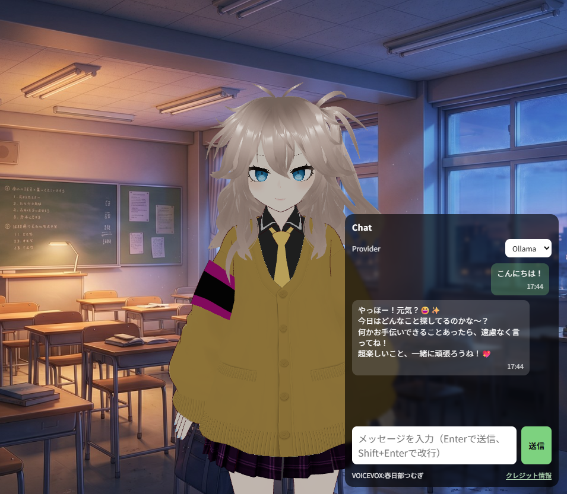

# voicevox-vrm-app



VRMモデルを表示し、チャット応答と音声再生を行うWebアプリです。

## 必要な環境

- Docker / Docker Compose
- または Node.js 22.x 以上 + npm

## セットアップ

1. リポジトリを取得します。

```bash
git clone <repository-url>
cd voicevox-vrm-app
```

2. 素材をダウンロードして配置します（同梱されていません）。

- `frontend/public/kasukabe-tumugi.vrm`
- `frontend/public/vrma/` 配下に `.vrma` ファイル一式
- `frontend/public/kyousitu.jpg`

3. 環境変数を用意します。

```bash
cp .env.example .env
```

- OpenAI/Geminiを使う場合は `.env` に `OPENAI_API_KEY` または `GEMINI_API_KEY` を設定してください。
- Ollamaのみ使う場合はAPIキー未設定でも動作します。

4. Dockerで起動します。

```bash
docker compose up --build
```

`http://localhost:5173` にアクセスしてください。

ローカル実行（Docker不使用）の場合:

```bash
cd frontend
npm install
npm run dev
```

## 素材クレジット

素材はライセンス都合により同梱していません。利用者が各配布元から取得してください。

### VRMモデル（kasukabe-tumugi.vrm）

- 配布元: https://hub.vroid.com/characters/5531251207168864092/models/5180681346901004831
- 利用条件: アバター利用 OK / 暴力表現 OK / 性的表現 OK / 法人利用 OK / 個人の商用利用 OK / 再配布 OK / 改変 OK
- クレジット表記: 不要

### VRMアニメーション（VRMA）

- 配布元: https://booth.pm/ja/items/5512385?registration=1
- クレジット要件（商用利用時）: 必須
- 指定文言（日本語）: キャラクターアニメーション: ピクシブ株式会社 VRoidプロジェクト
- 指定文言（英語）: Animation credits to pixiv Inc.'s VRoid Project

### 背景画像（kyousitu.jpg）

- 配布元: https://github.com/Yakisobites/voicevox-vrm-app/releases/download/1.0.1/kyousitu.zip
- 配置先: `frontend/public/kyousitu.jpg`

### VOICEVOX音声（春日部つむぎ）

- クレジット要件: 必須
- 指定文言: VOICEVOX:春日部つむぎ
- 参照: https://voicevox.hiroshiba.jp/product/kasukabe_tsumugi/

## ライセンス

このプロジェクトは [LICENSE](LICENSE) の条件で提供されます。

## トラブルシューティング

| 症状                    | 原因                                          | 対応                                                 |
| ----------------------- | --------------------------------------------- | ---------------------------------------------------- |
| VRMが表示されない       | `frontend/public` にモデルがない              | `kasukabe-tumugi.vrm` を配置                         |
| 動作が単調になる        | `frontend/public/vrma` にアニメーションがない | `.vrma` 一式を配置                                   |
| 背景が表示されない      | `frontend/public` に背景画像がない            | `kyousitu.jpg` を配置                                |
| 音声が再生されない      | VOICEVOXサービス未起動                        | `docker compose up --build` で `voicevox` を起動     |
| OpenAI/Geminiが失敗する | APIキー未設定または無効                       | `.env` の `OPENAI_API_KEY` / `GEMINI_API_KEY` を確認 |
